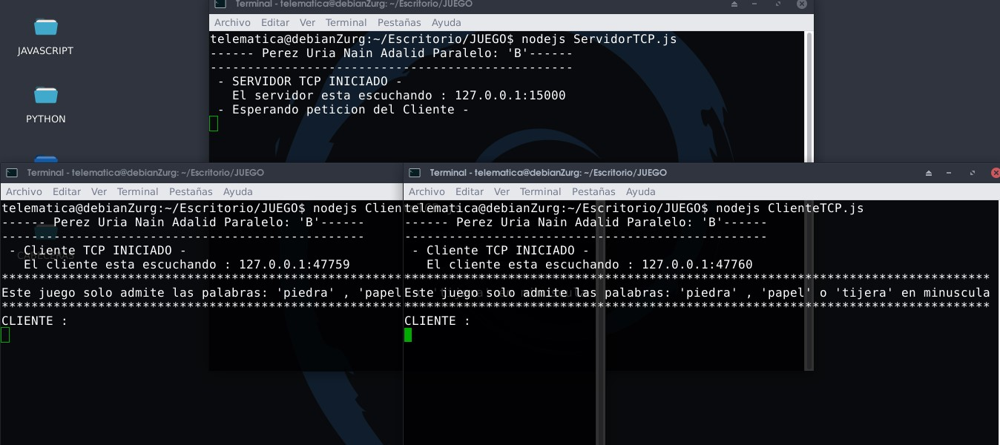
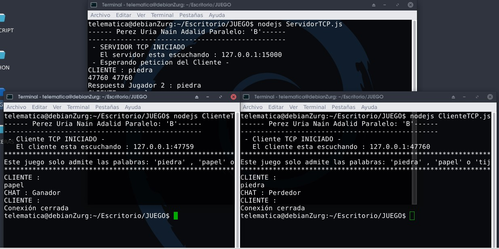
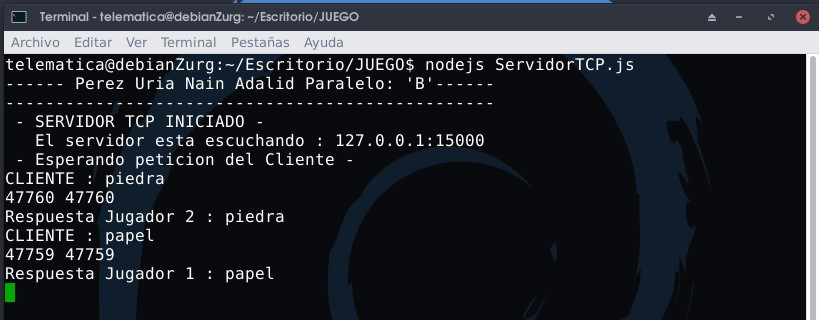
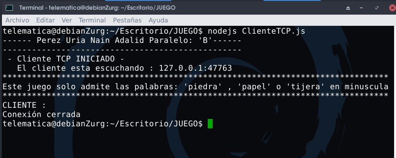

# Juego_piedra_papel_o_tijera
Construcción del juego piedra papel o tijera mediante sockets

**_La primera captura muestra la ejecucion del servidor y dos clientes representando dos jugadores_**

  

**_La segunda captura muestra como estos dos clientes jugaron y a cada uno se le mando un mensaje si perdio o gano cuando los dos jugadores mandaron su opcion entre piedra, papel o tijera_**

  

**_Esta tercera captura muestra el servidor recibiendo las respuestas de los dos jugadores_**

  

**_Esta tercera captura muestra que cuando un nuevo jugador quiere unirse el servidor no le dejara realizar la conexion_**

  

